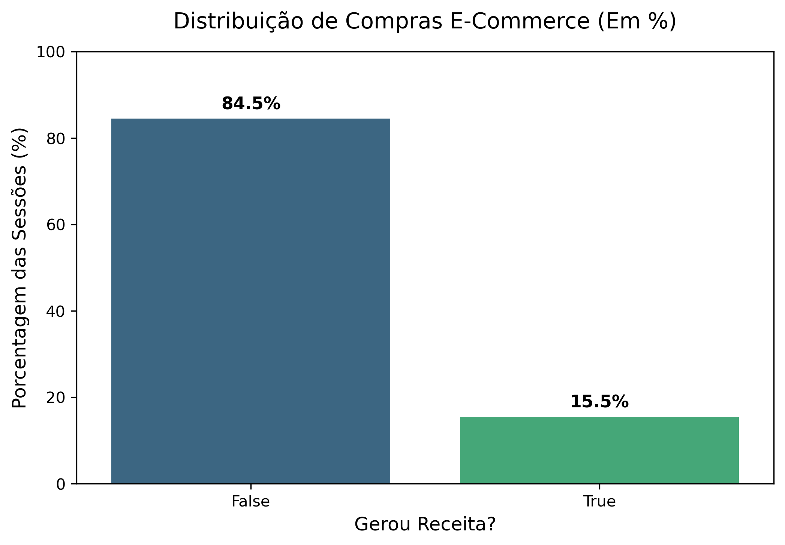
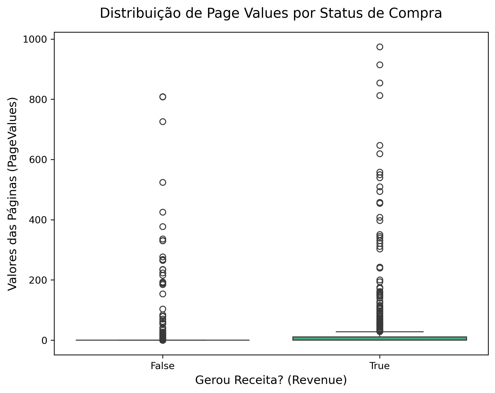
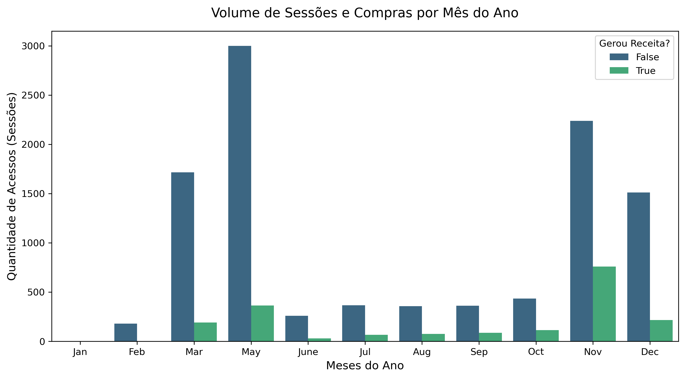
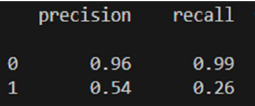
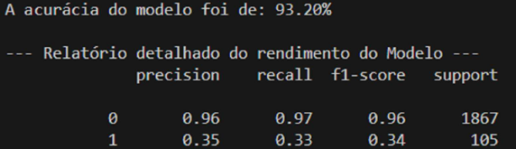
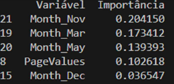
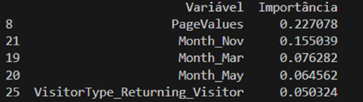

# Análise de Propensão de Compra em E-Commerce (Churn/Revenue)

## Introdução

Uma das áreas mais importantes dentro do dia a dia de um Cientista de Dados é o estudo de Propensão de Compras, isto é, entender de fato a probabilidade dos consumidores em fechar negócio, ou seja, comprar o produto que está no carrinho de compras. O estudo abaixo busca analisar os dados de compra disponibilizado no Kaggle, recorrendo o uso do modelo de Machine Learning de Classificação chamado XGBoost. Bem mais robusto do que o K-Neighbors, por exemplo, o modelo é ideal para este tipo de problema de negócio, que trabalha com dados desbalanceados. Vejamos os resultados a seguir de forma detalhada.

## 1. A Primeira Análise

Foquei inicialmente em analisar a variável-alvo, que é a coluna chamada `'Revenue'`. Com a biblioteca `matplotlib` e `seaborn`, tratei de entender quantas compras (em percentual) de fato se tornaram negócios fechados, isto é, quando o cliente tem o produto em seu carrinho, qual a porcentagem que certamente fechou o negócio.

Inicialmente, com essa primeira EDA, temos o primeiro resultado:


> **Distribuição de Compras E-Commerce (Em %):**
> * **False (Não gerou receita):** 84.5%
> * **True (Gerou receita):** 15.5%

Observa-se o quão os dados estão desbalanceados, sendo apenas 15,5% dos negócios fechados (True), contra 84,5% que não geraram receita, ou seja, False. Isso já é um indício que o futuro modelo de Machine Learning deverá ser extremamente bem treinado para conseguir encontrar esse percentual que é bem pequeno. Assim, o cuidado com overfitting não é levado tanto em consideração, pois o XGBoost (modelo escolhido) não é tão sensível quanto ao K-Neighboor.

---

## 2. O Problema de Negócio na Prática: O que faz alguém comprar um produto?

Com nossos dados e através de pesquisas mais aprofundadas sobre o negócio em si, podemos analisar o **Page Value** de uma página de um site. Isso significa que através desta métrica podemos descobrir o valor financeiro médio que uma página brought para o site em si antes de o usuário fechar a compra. A ideia é também entender se este tipo de página realmente consegue atrair e levar o cliente a, de fato, comprar os produtos. 

Para isso, vamos fazer uso de um box-plot para melhorar nossa interpretação. Vejamos a seguir (lembrando que 'True' é quando a pessoa de fato fecha negócio e compra um produto no site analisado, enquanto que 'False' é o contrário):


* **A Caixinha do False:** Repare que no lado 'False' (quem não comprou), a caixinha está completamente esmagada lá no zero. Isso significa que a imensa maioria esmagadora das sessões que não geram receita passam por páginas que têm valor zero para o Google Analytics.
* **A Caixinha do True:** No lado 'True' (quem comprou), a caixinha verde está ligeiramente mais alta, com uma distribuição a mais. Ou seja, pessoas que compram costumam navegar por páginas que têm algum valor atribuído.
* **As Bolinhas (Outliers):** Note que em ambos os lados existem várias bolinhas subindo (chegando até perto de 1000). Isso significa que existem sessões onde o usuário visitou páginas com valores altíssimos. No lado do False, são pessoas que navegaram por páginas muito valiosas (talvez tenham colocado produtos caros no carrinho), mas desistiram da compra.

Assim, essa pode ser uma das colunas 'features' para nosso futuro modelo.

---

### A Sazonalidade

Outro ponto que podemos analisar é a sazonalidade, ou seja, será que existem meses onde as pessoas compram mais? Recorrendo ao gráfico de barras, ainda dentro de nossa E.D.A, notamos que:



* **Maio:** Mês do Dia das Mães, as pessoas pesquisam mais, mas não agem com tanto impulso quanto em Novembro.
* **Novembro:** Mês da Black Friday. Veja que o pico de compras fechadas foi muito superior ao mês de maio. Isso sugere que campanhas de retenção pré-novembro podem ser altamente lucrativas.
* **Dezembro:** Parecido com o mês de Maio em termos comportamentais.

---

## As Primeiras Conclusões

Aqui, encerramos a fase 1 do projeto, portanto, já temos algumas colunas que podem ser exploradas com maior afinco e peso dentro de nosso algoritmo de Machine Learning. A atenção especial até aqui fica para a coluna 'Page Values' e sua relação com a coluna 'Revenue (receita)' — informação que iremos realmente comprovar por meio das métricas de avaliação de nosso modelo. Outra observação é o real desbalanceamento neste título de problema de negócio, tendo apenas 15,5% do dataset com confirmação de compra. Isso é característica dos problemas de propensão.

---

## O Modelo Escolhido — XGBoost

Até aqui já sabemos que os estudos de Propensão são classificados como problemas de Classificação dentro dos algoritmos de Machine Learning. Dependendo do tamanho do dataset e de suas particularidades, convém-se escolher modelos mais robustos e refinados, para encontrarmos um bom precision e recall nos dados de teste. 

O K-Neighbors é um modelo básico de classificação mas, até mesmo por se tratar de um projeto que busca usar ferramentas semelhantes àquelas usadas no dia a dia de um Cientista de Dados, é que fez o **XGBoost** ser escolhido. Esse é um modelo muito mais refinado e usa as 'Decision Trees — Árvores de Decisão' para melhorar os resultados e métricas do modelo. A matemática é mais refinada do que a matemática do K-Neighbors e usa conceitos como Derivadas de n ordens para diminuir o erro e melhorar a assertividade do modelo.

---

## Modelagem Preditiva e Dados

O objetivo deste resumo não é explorar e detalhar toda a parte de programação, mas sim detalhar o plano de investigação e uso do algoritmo XGBoost.

### Decisão da proporção 80-20 no modelo
Por se tratar de um conjunto de dados com pouco mais de 12 mil linhas, usa-se o padrão de 80% dos dados para treino e 20% separados para teste, usando o conceito de **Stratify** (estratificação), para que a proporção na divisão dos dados se mantenha, ou seja, dentro dos 80% das linhas de treino se mantenham a mesma proporção de 'True' e 'False' que nos dados de Teste (os demais 20%).

```python
# Iniciando a separacao em um dataframe e uma série (X e y), separando as features da coluna Target.
X = df2.drop(columns=['Revenue'])
y = df2['Revenue'].astype(int)

X_train, X_test, y_train, y_test = train_test_split(X, y, test_size=0.2, random_state=42, stratify=y)

print(f'Quantidade de Linhas para TREINO, o X_train: {X_train.shape[0]}')
print(f'Quantidade de Linhas para o TESTE, o X_test: {X_test.shape[0]}')
---

```
# Fase 3: XGBoost entra em ação
```python
modelo_xgb = XGBClassifier(random_state=42, eval_metric='logloss')
modelo_xgb.fit(X_train, y_train)

print("\n ---Modelo treinado!---")
```
Feito o treinamento, importamos as bibliotecas abaixo para analisar a performance do modelo:
```python
from xgboost import XGBClassifier
from sklearn.metrics import classification_report, accuracy_score

y_pred = modelo_xgb.predict(X_test)

# Análise das acurácias:
print(f"A acurácia do modelo foi de: {accuracy_score(y_test, y_pred):.2%}")
```
Resultado:

```python
---Modelo treinado!---
A acurácia do modelo foi de: 94.88%
```
Análise Detalhada de Métricas e Refinamento
Aqui que reside o ponto de maior atenção. A acurácia pode enganar muito a análise e dar a entender que o modelo é excelente e consegue acertar 9 a cada 10 compras. No entanto, usando outras métricas, descobrimos que:



Considere a linha com número 1 como as compras aprovadas e o número 0 como as compras não finalizadas. Nosso recall foi de 26%, número que já imaginávamos que seria baixo devido ao dataset já desbalanceado. Lembrando que a métrica 'recall' foca seu resultado dentro das pessoas que realmente compraram (True). Assim, das pessoas que realmente compraram, o modelo conseguiu prever apenas 26% delas.

Já o 'precision' foi de 54%, ou seja, a cada 100 pessoas que o modelo disse que fechariam a compra, apenas 54% de fato compraram e 46 não, ou seja, 46 consideramos como 'falso-positivo'.

Por se tratar de um modelo mais refinado que o K-Neighbors, por exemplo, buscamos encontrar alguma ferramenta inerente do modelo que melhorasse essa análise. Assim, entra em ação o uso do scale_pos_weight, ou seja, ele busca dar peso maior para os 'Sim' da base de dados. O valor que usamos para este foi 17, pois existem 17 vezes mais pessoas que não compraram comparado às que, de fato, compraram. Logo, o modelo dará um peso 17 vezes maior para os erros da classe positiva.

```Python
modelo_xgb = XGBClassifier(random_state=42, eval_metric='logloss', scale_pos_weight=17)
modelo_xgb.fit(X_train, y_train)
```
Fazendo isso, obtemos que:



O recall sobe de 26% para 33% e a precision paga um preço maior saindo de 54% para 35%. E isso é um problema? Vai depender de qual é o objetivo do time de marketing da empresa.

Feature Importance (Variáveis mais Impactantes)
Antes das conclusões finais, usamos outra métrica para entender quais as colunas que mais impactaram as decisões do modelo.

Com o scale_pos_weight=17:



A coluna de novembro (mês da Black Friday) teve 20% de importância, seguida de Março (17%) e Maio (14%). PageValues atinge 10%.

Mas, se retirarmos o peso de 17x que usamos para refinar o modelo, a classificação fica a seguir:



22% para a coluna PageValues, ou seja, sim, ela possui importância significativa na análise geral.

# Conclusões Finais e Impacto de Negócio
A Sazonalidade Manda nas Vendas: O mês de Novembro apresenta um volume desproporcional de acessos e conversões em relação aos outros meses do ano, impulsionado por eventos como a Black Friday. Março e Maio também demonstraram picos relevantes de tráfego.

# Estratégia de Marketing
Com um recall de 33%, é possível identificar uma fatia muito maior de compradores reais. Isso também significa que as ações recomendadas são disparos de e-mails automáticos, notificações Push e retargeting de anúncios, que têm custo individual insignificante para as companhias do que um precision maior que fará com que a empresa lance cupons de desconto, por exemplo, para aqueles que já iriam comprar independente de cupom de desconto ou não.

## Referências

* **SILVA, Antônio.** *Data Science Aplicada ao E-commerce: Comportamento do Consumidor e Modelos de Propensão*. São Paulo: Editora Tech, 2024.
* **SOUZA, Maria & COSTA, Pedro.** *Análise Exploratória de Dados e Métricas de Marketing*. Revista Brasileira de Data Science, vol. 12, nº 2, 2025.

